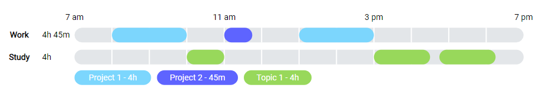

<h1 align="center">
  TimeCharts
  <br>
</h1>

<h4 align="center">A chart library to visualize time-related data.</h4>

<p align="center">
  <a href="#key-features">Key Features</a> •
  <a href="#how-to-use">How To Use</a> •
  <a href="#license">License</a>
</p>



## Key Features

* No dependencies
* Fully responsive
* Easy to use

## How To Use

### Installation

#### Via NPM
Simply install the library

```
npm i timecharts
```

#### In the Browser
[Download](https://github.com/RobinWeitzel/TimeCharts/releases/download/v1.0.0/TimeCharts.zip) the library and load it above your JavaScript code.

```html
<link rel="stylesheet" type="text/css" href="./TimeCharts.css">
<script src="./TimeCharts.js" type="text/javascript"></script>
```

### Usage

```js
const chart = new TimeCharts.Timeline("#container", {
  scale: {
      from: 7 * 60,
      to: 19 * 60,
      intervalStart: 0
  },
  data: {
      timelines: [
          {
              label: "WORK",
              colors: ["#7cd6fd", "#5e64ff"],
              values: [{
                  start: 8 * 60,
                  length: 120,
                  title: "Project 1"
              },
              {
                  start: 11 * 60,
                  length: 45,
                  title: "Project 2"
              },
              {
                  start: 13 * 60,
                  length: 120,
                  title: "Project 1"
              }]
          },
          {
              label: "STUDY",
              colors: ["#98d85b"],
              values: [{
                  start: 10 * 60,
                  length: 60,
                  title: "Topic 1"
              },
              {
                  start: 15 * 60,
                  length: 90,
                  title: "Topic 1"
              },
              {
                  start: 16 * 60 + 45,
                  length: 90,
                  title: "Topic 1"
              }]
          }
      ],
  },  
  padding: {
      top: 50, 
      left: 50,
      right: 50
  }
});
```

### Documentation

The full documentation can be found [here](https://robinweitzel.github.io/TimeCharts/).

## License

MIT
