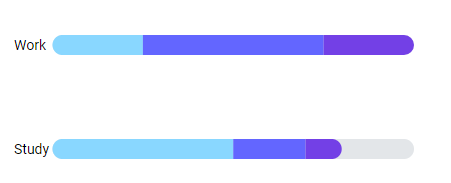

<h1 align="center">
  TimeCharts
  <br>
</h1>

<h4 align="center">A chart library focusing on visualizing time-related data.</h4>

<p align="center">
  <a href="#key-features">Key Features</a> •
  <a href="#how-to-use">How To Use</a> •
  <a href="#license">License</a>
</p>



## Key Features

* No dependencies
* Fully responsive
* Easy to use

## How To Use

### Installation
Just download the library and load it above your JavaScript code.

```html
<script src="TimeCharts.js"></script>
```

### Usage

```js
const chart = new TimeCharts.Barchart("#container", {
  data: {
    labels: ["Work", "Study"],
    datasets: [
        {
            values: [0.25, 0.5],
            title: "test"
        },
        {
            values: [0.5, 0.2]
        },
        {
            values: [0.25, 0.1]
        },
    ],
  },
  orientation: "horizontal",
  padding: {
      top: 50, 
      left: 50,
      right: 50
  }
});    
```

### Documentation

The full documentation can be found [here](https://robinweitzel.github.io/TimeCharts/).

## License

MIT
